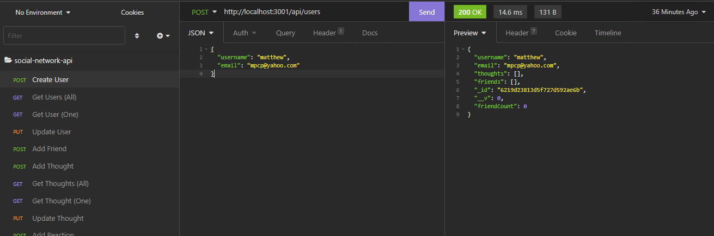

# social-network-api

## Project Overview

This project is an API for a social network web application where users can share their thoughts, react to friends' thoughts, and create a friends list. 

Technologies Used: 
- Express.js
- MongoDB
- Mongoose ODM
- Javascript

## Installation

Tools Needed:

1. Terminal (MacOS) or
   [GitBash](https://gitforwindows.org/) (Windows)
2. Have a Github account (Not Required)
3. Install text editor of your choice (e.g. VSCode, Atom, etc.)

How to view the project:

1. Navigate in terminal/gitbash where you want to save the project
2. Clone the project via HTTPS or SSH link found in my GitHub repo 
    https://github.com/plotinusspascual/social-network-api
3. After entering the command 'git clone [HTTPS/SSH Link]' in terminal, use command 'code .' to open the project in your default text editor
4. Right click on 'Index.html' and view in live browser to see the website 

## Features

This API allows: 

- Create a user
- Update a user
- User adds User
- Create Thoughts
- Update Thoughts
- React to Thoughts

## Images 

Below is a gif showcasing some of the elements and functions of my website. 

## Built With

* [HTML](https://developer.mozilla.org/en-US/docs/Web/HTML)
* [CSS](https://developer.mozilla.org/en-US/docs/Web/CSS)
* [MONGOOSE](https://mongoosejs.com/docs/)
* [MONGODB](https://www.mongodb.com/)

## Walkthrough Video

* [See Walkthrough Video](https://youtu.be/KPCMAqEW2I4)

## Authors

* **Jose Pascual** 

- [Link to Github](https://github.com/plotinusspascual)
- [Link to LinkedIn](https://www.linkedin.com/in/jose-plotinuss-pascual/)

## License

This project is licensed under the MIT License 

## Contributing

If there are anything I missed or could have done more efficiently please feel free to message me directly through Github

© 2021 Trilogy Education Services, LLC, a 2U, Inc. brand. Confidential and Proprietary. All Rights Reserved.
